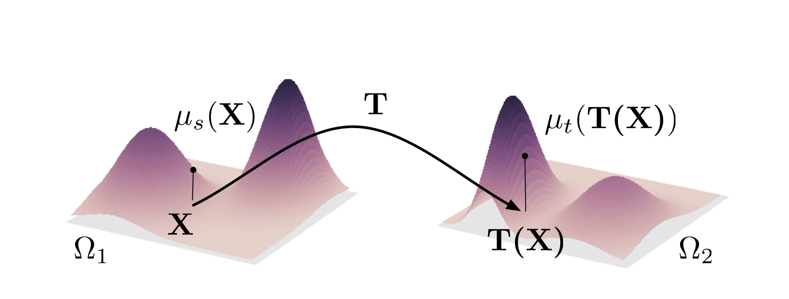
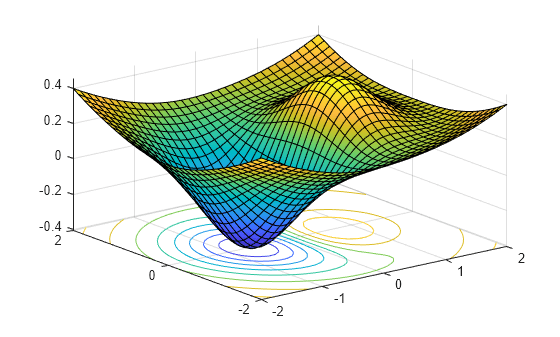
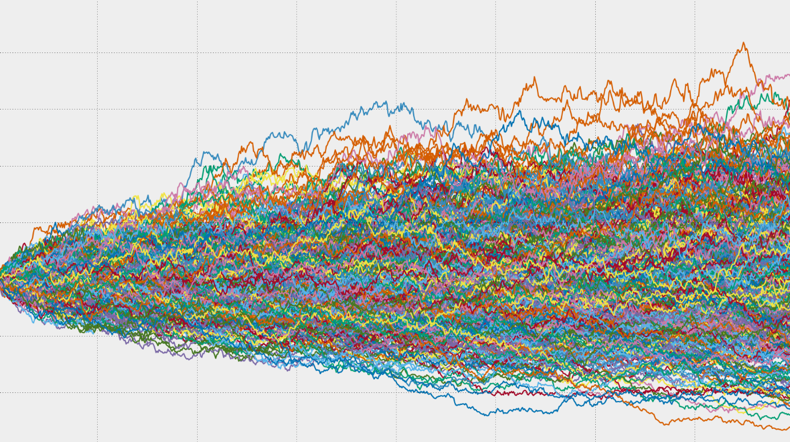

::: {.home-hero}

::: {.home-images}
{.home-photo fig-alt="optimal_transport"}
{.home-photo fig-alt="optimization"}
{.home-photo fig-alt="stochastic"}
:::

::: {.home-text}

This is the personal blog of Su Baozhuo, who has a wide range of research interests. More specifically, for theoretical research:

- Optimization on Manifolds
- Optimal Transport 
- Game Theory
- Statistical Learning
- Stochastic Processes

and many applied topics, such as high performance solvers, bioinformatics, anti-deepfake,etc.

This blog serves as his personal homepage and he will update irregularly his new paper, new idea, mathematical proofs, blogs, including thoughts on life and even his new guitar music.

His life is inspired by 3Ms: ***Mathematics, Music and Monde***. His [CV](files/CV.pdf) 
:::
:::